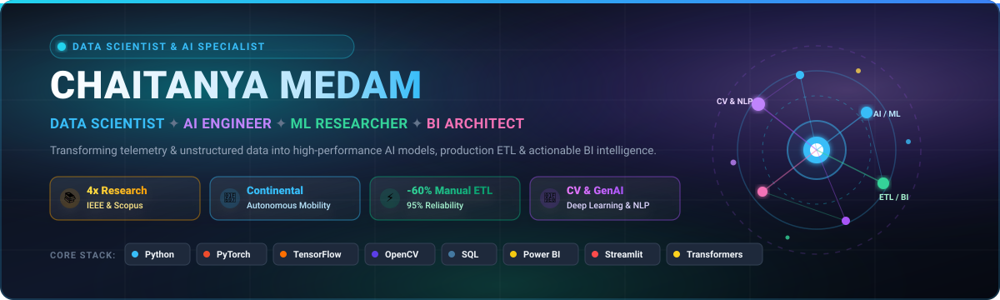

<!-- 🌟 LinkedIn-Style Hero Cover Banner 🌟 -->

 

<!-- Dynamic Multi-Color Typing Animation -->

  
  
  
  

---

<!-- Key Highlights / Metrics Counter Bar -->
<table align="center">
  <tr>
    <td align="center">💼 <b>Experience</b> <b>2+ Years</b></td>
    <td align="center">📚 <b>Publications</b> <b>4 Papers (IEEE & Scopus)</b></td>
    <td align="center">⚡ <b>ETL Efficiency</b> <b>-60% Manual Effort</b></td>
    <td align="center">🎯 <b>Reliability & Accuracy</b> <b>Up to 95%</b></td>
  </tr>
</table>

---

## 📌 Executive Summary

I am a **Data Scientist & AI Engineer** with over 2 years of experience developing production-grade machine learning models, computer vision systems, natural language processing solutions, and automated data architectures. 

- 🚀 **Industry Experience:** Built scalable telemetry ETL pipelines and real-time BI dashboards at **Continental Autonomous Mobility**, cutting manual reporting effort by **60%** and improving operational reliability from **85% to 95%**.
- 🔬 **Published Research:** Authored **4 international research papers** published in **IEEE Xplore** and indexed by **Scopus**, spanning temporal self-attention conversational agents, road surface defect detection via attention-enhanced YOLO, and noise-aware autoencoders for biomedical IoT sensors.
- 💡 **Core Focus:** Bridging research and engineering by designing robust data pipelines, scalable predictive algorithms, and intuitive decision-support tools.

---

## 🛠️ Technical Arsenal

### 💻 Programming & Frameworks

### 🤖 Machine Learning, Deep Learning & Generative AI

### 📊 Data Analytics & Business Intelligence

### ☁️ Data Engineering, Cloud & DevOps

---

## 🔬 Research & Publications

> Author of **4 international peer-reviewed research papers** published in **IEEE Xplore** and indexed by **Scopus**:

1. **CADEF-TSAIL-MHARB: A Context-Aware Dual Encoding Fusion Framework with Temporal Self-Attention Injection Layer and Multi-Head Refinement for Intelligent Conversational Chatbots**  
   *4th International Conference on Integrated Circuits and Communication Systems (ICICACS 2026)*  
   `Published — IEEE Xplore` | `Scopus Indexed`  
   *Proposed a dual-encoding fusion framework injecting temporal self-attention layers to significantly enhance conversational context retention and response generation accuracy.*

2. **An Attention-Enhanced YOLO Framework with IMU Confidence for Road Surface Defect Analysis**  
   *2nd International Conference on Intelligent Systems and Computational Networks (ICISCN 2026)*  
   `Published — IEEE Xplore`  
   *Engineered an attention-augmented computer vision architecture fusing inertial measurement unit (IMU) telemetry with YOLO for high-accuracy road surface defect classification.*

3. **Noise-Aware Adaptive Autoencoder for Denoising Physiological Signals in Biomedical IoT Wearable Sensors**  
   *3rd International Conference on Wireless Communication and Internet of Everything (ICWCIE 2026)*  
   `Presented`  
   *Developed deep learning denoising autoencoders to clean artifact-prone physiological telemetry from low-power wearable biomedical sensors.*

4. **Secure and Energy-Efficient Device-to-Device Communication Using Adaptive Lightweight Cryptography**  
   *3rd International Conference on Wireless Communication and Internet of Everything (ICWCIE 2026)*  
   `Presented`  
   *Designed lightweight adaptive encryption algorithms optimized for edge IoT devices with strict compute and battery constraints.*

---

## 🚀 Featured Projects

<table>
  <tr>
    <td width="50%">
      <h3>🔍 Customer Sentiment Analysis Dashboard</h3>
      
Built an end-to-end NLP analytics pipeline analyzing 3,000+ customer reviews with automated data cleaning, EDA, and sentiment classification.

      <ul>
        <li>Interactive Streamlit dashboard with multi-dimensional filtering (variation, rating, sentiment).</li>
        <li>Actionable keyword visualizations and sentiment distribution for non-technical teams.</li>
      </ul>
      
<b>Tech:</b> <code>Python</code> <code>Pandas</code> <code>Scikit-learn</code> <code>NLTK</code> <code>Streamlit</code> <code>Plotly</code>

    </td>
    <td width="50%">
      <h3>🚗 Advanced Lane Detection System</h3>
      
Real-time autonomous vehicle lane detection system using convolutional neural networks and computer vision, processing 10,000+ video frames.

      <ul>
        <li>Applied image preprocessing, edge detection, perspective transform, and polynomial curve fitting.</li>
        <li>Achieved <b>92% detection accuracy</b> in varying road and illumination conditions.</li>
      </ul>
      
<b>Tech:</b> <code>Python</code> <code>TensorFlow</code> <code>OpenCV</code> <code>NumPy</code>

    </td>
  </tr>
  <tr>
    <td width="50%">
      <h3>✋ Real-Time Gesture Recognition System</h3>
      
Computer vision application built on deep learning for real-time sign and gesture classification, trained on 1,500+ custom annotated samples.

      <ul>
        <li>Achieved <b>95% classification accuracy</b> with ultra-responsive <b>&lt;100ms latency</b>.</li>
        <li>Integrated robust landmark tracking for seamless interactive control.</li>
      </ul>
      
<b>Tech:</b> <code>TensorFlow</code> <code>OpenCV</code> <code>MediaPipe</code> <code>Python</code>

    </td>
    <td width="50%">
      <h3>🔗 Blockchain-Based LOR Verification Platform</h3>
      
Decentralized credential and Letter of Recommendation verification system built on the Ethereum blockchain with smart contracts.

      <ul>
        <li>Integrated React.js frontend with Web3 smart contract backend.</li>
        <li>Reduced manual verification turnaround time by <b>85%</b> with tamper-proof security.</li>
      </ul>
      
<b>Tech:</b> <code>Solidity</code> <code>Ethereum</code> <code>Ganache</code> <code>Truffle</code> <code>React.js</code>

    </td>
  </tr>
  <tr>
    <td colspan="2">
      <h3>📰 AI Newspaper Summarizer</h3>
      
Comprehensive NLP-driven summarization engine generating concise, coherent article digests utilizing syntactic parsing, entity recognition, and modern transformer architectures (BART & T5).

      
<b>Tech:</b> <code>Python</code> <code>Hugging Face Transformers</code> <code>BART</code> <code>T5</code> <code>spaCy</code> <code>NLTK</code>

    </td>
  </tr>
</table>

---

## 💼 Professional Experience

- **Freelance Data Scientist & Prompt Engineer** *(Self-Employed | Jan 2025 – Mar 2026)*
  - Designed custom prompt engineering workflows and pipelines for Large Language Model (LLM) applications.
  - Engineered predictive models, interactive analytical dashboards, and production Streamlit apps for diverse clients.
  - Developed end-to-end machine learning pipelines from ingestion through deployment.

- **Data Scientist & Software Engineer Trainee** *(Continental Autonomous Mobility | Oct 2024 – Aug 2025)*
  - Built automated telemetry and performance data ETL pipelines using Python, SQL, and Pandas, reducing manual processing time by **60%**.
  - Designed interactive Power BI dashboards that accelerated stakeholder decision-making cycles by **20%**.
  - Raised system reliability from **85% to 95%** through proactive predictive monitoring and analytics.
  - Deployed, automated, and validated analytics workloads within Linux production environments.

- **AI Engineer Intern** *(SmartBridge | May 2023 – Jul 2023)*
  - Built contextual machine learning recommendation models achieving **85% prediction accuracy**.
  - Conducted exploratory data analysis, feature engineering, and statistical evaluations for stakeholder reporting.

- **Web Developer** *(CITTA Health Services | Jun 2023 – Jul 2023)*
  - Built and maintained responsive, high-performance web applications using modern web standards.

---

## 🎓 Education & Certifications

- 🎓 **Master of Technology (Integrated) in Computer Science & Engineering**  
  *Vellore Institute of Technology (VIT), Vellore* | **CGPA: 7.94** (2025)
- 📜 **Google Data Analytics Professional Certificate** 
- 📜 **Automation Anywhere RPA Professional**
- 📜 **Complete Data Science Bootcamp** 

---

## 📊 GitHub Analytics

  
  

  

---

## 📫 Let's Connect!

I am always keen to discuss machine learning research, data engineering challenges, BI dashboarding, or potential collaborations.

 

⭐ *Feel free to explore my repositories — if you find something exiting or interesting, give it a star!*

